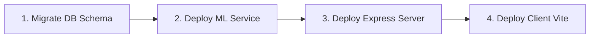
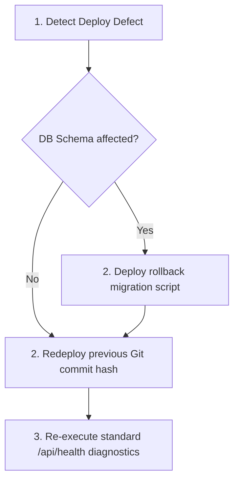

# 🚀 ReviewLens Production Readiness Checklist

This document details the mandatory infrastructure setups, database migrations, configuration validations, backup plans, monitoring parameters, and rollback procedures required to safely deploy the ReviewLens Skincare Recommendations platform to a production-grade environment.

---

## 📋 1. Environment Setup

Configure these environment variables in your secure hosting manager (e.g. AWS Parameter Store, Vercel Env Manager, or Heroku Config Vars). Never write raw credentials in committed files.

### 🔌 Backend Server & Gateway (`/server`)
| Variable | Expected Value / Type | Purpose |
| :--- | :--- | :--- |
| `PORT` | Alphanumeric (e.g. `5000` or `443`) | Binds Express network port. |
| `JWT_SECRET` | 256-bit Hexadecimal String | Secures and validates Supabase session signatures. |
| `SUPABASE_URL` | HTTPS Supabase Endpoint URL | Directs backend queries to Supabase database. |
| `SUPABASE_KEY` | Supabase `anon` public key | Authenticates secure client actions. |
| `AI_API_KEY` | Groq / Gemini API Token | Authenticates LLM RAG pipelines. |
| `GEMINI_API_KEY` | (Alternative) Gemini API Key | Primary AI engine. |
| `GROQ_API_KEY` | (Alternative) Groq API Key | Secondary fallback AI engine. |

### ⚡ Client Frontend (`/client`)
| Variable | Expected Value / Type | Purpose |
| :--- | :--- | :--- |
| `VITE_SUPABASE_URL` | HTTPS Supabase URL | Links browser auth/queries to Supabase. |
| `VITE_SUPABASE_ANON_KEY` | Supabase public key | Authenticates client SDK actions. |
| `VITE_API_URL` | Canonical Backend API URL | Routes API requests to backend Express gateway. |

### 🐍 Python AI ML Service (`/ml_service`)
| Variable | Expected Value / Type | Purpose |
| :--- | :--- | :--- |
| `PORT` | Numeric (e.g. `8000`) | Binds FastAPI network port. |
| `FRONTEND_URL` | Canonical Frontend URL | Enforces secure CORS Whitelist restrictions. |
| `GEMINI_API_KEY` | Gemini API Key | Primary RAG synthesis engine. |
| `GROQ_API_KEY` | Groq API Key | Secondary fallback comparison engine. |

---

## 🛢️ 2. Database Migrations

Always backup your active schemas before running migrations. Run database migrations sequentially:

1. **Database Schema Initialization**:
   ```bash
   mysql -u root -p ai_recommender < database/schema_v3.sql
   mysql -u root -p ai_recommender < database/migration_v3.sql
   ```
2. **Feature Extensions**:
   - Create feedback tables, standard indices, and the clinical RAG database layout:
   ```bash
   mysql -u root -p ai_recommender < database/feedback_schema.sql
   mysql -u root -p ai_recommender < database/knowledge_schema.sql
   ```
3. **Data Seeds Loading**:
   - Seed skincare products catalogs and clinical knowledge entries:
   ```bash
   mysql -u root -p ai_recommender < database/skincare_data.sql
   mysql -u root -p ai_recommender < database/knowledge_data.sql
   ```

---

## 🚀 3. Deployment Steps

Follow this precise deploy sequence to prevent runtime service degradation:



### Step 1: Database Deploy
- Connect to your production database host and apply outstanding schemas (Section 2).

### Step 2: FastAPI ML AI Service Deploy
- Push `/ml_service` to your virtual server or container manager (e.g. AWS ECS, GCP Cloud Run).
- Ensure Python dependencies are frozen and cached:
  ```bash
  pip install -r requirements.txt
  ```
- Startup command:
  ```bash
  uvicorn app:app --host 0.0.0.0 --port 8000 --workers 4
  ```

### Step 3: Express Backend Deploy
- Deploy `/server` (e.g. Render, AWS BeanStalk, Heroku).
- Freeze npm dependencies:
  ```bash
  npm ci --only=production
  ```
- Startup command:
  ```bash
  node server.js
  ```

### Step 4: Vite Client Deploy
- Compile Vite client production assets:
  ```bash
  cd client && npm run build
  ```
- Deploy static `/dist` directory to a premium global CDN (e.g. Netlify, Vercel, AWS S3+CloudFront).

---

## 🛡️ 4. Backup Strategy

To prevent disaster data loss, implement the standard daily backup policy:

| System Layer | Method | Frequency | Retention Policy |
| :--- | :--- | :--- | :--- |
| **Relational Database** | Automated Snapshot backups | Every 24 hours (Off-peak) | Retain for 30 days |
| **Object Storage** | S3 bucket versioning & cross-region replication | Event-based | Retain for 90 days |
| **Configurations** | Encrypted config vaults (AWS Parameter Store) | On change | Indefinite |

*To perform a manual database snapshot recovery:*
```bash
# Export schema and seed data
mysqldump -u [user] -p [database_name] > backup_snapshot_$(date +%F).sql
```

---

## 📊 5. Monitoring Setup

Continuous telemetry is critical to trace API latency, database health, and AI uptime.

1. **Central Uptime Monitors**:
   - Setup a health checker pointing to `/api/health` every **30 seconds**.
   - Alert notifications must trigger if the health route returns a non-200 code or exceeds a **2500ms** latency timeout.
2. **Log Rotations & File Audits**:
   - Configure winston log transports.
   - Monitor `logs/error.log` for anomalous syntax errors or database disconnect flags.
3. **Trace Auditing**:
   - Trace correlation `X-Request-ID` headers to align gateway events with internal microservice queries.

---

## ↩️ 6. Rollback Procedure

If the production deployment fails verification checks or logs a surge of `5xx` errors, trigger the standard rollback procedure within **5 minutes**:



1. **Revert Frontend**: Point the CDN target pointer back to the previous successful build ID.
2. **Revert Backend API**: Redeploy the last stable Git commit hash.
3. **Database Recovery**: If the database schema was modified, apply standard backward rollback scripts immediately or restore from the latest manual off-peak SQL snapshot.
4. **Post-Rollback Diagnostics**: Re-run all automated system validators and examine active telemetry logs to confirm services return to normal operational limits.
